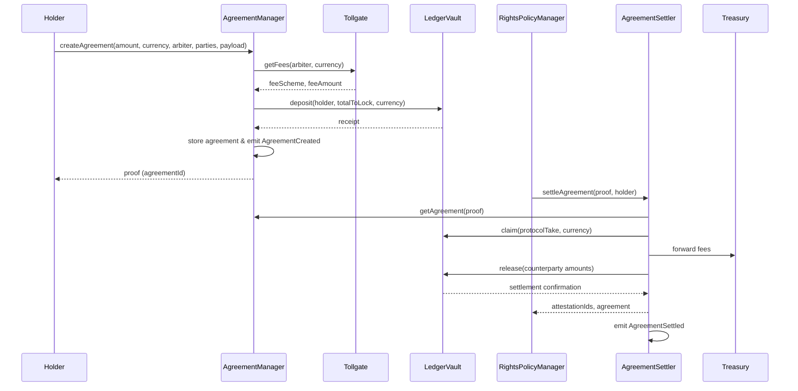

## Synapse Protocol – Auditor Documentation (v1)

> **Scope**: Assets, Policy & Rights Enforcement, Finance (Escrow & Settlements), Economics, Governance, Access Control  
> **Out of Scope**: Custodian Network (DePIN), DWRR routing, replication/delivery infrastructure

---

### 1. Overview

Synapse Protocol delivers a deterministic coordination layer for digital asset registration, licensing, and monetization. Programmable access rules are executed on-chain, governed by role-based permissions and quorum-driven workflows. This document captures architecture, module summaries, interdependencies, and audit checkpoints.

---

### 2. Layered System Architecture

| Layer | Purpose | Key Components | Notes |
| --- | --- | --- | --- |
| **Blockchain Layer** | Anchors protocol state on EVM networks, executes verifiable rights and settlement logic. | Deployed contracts for Assets, Rights, Policies, Finance, Governance, Access Control. | Stateless interactions via calldata; deterministic execution supports audits & integrations. |
| **Coordination Layer** | Core execution environment managing registries, policies, governance, fees. | Asset & policy registries, rights authorizers, settlement engines. | Primary audit scope; ensures modules compose deterministically. |
| **Integration Layer** | Bridges external applications, attestation services, marketplaces. | `IAttestationProvider` implementations, future SEP integrations. | Currently minimal; attestations pluggable through `PolicyBase`. |

---

### 3. Smart Contract Summary

| Module | Description & Logic | Core Contracts | Critical Functions | Relationships & Dependencies |
| --- | --- | --- | --- | --- |
| **Assets** | ERC-721 asset lifecycle with governance-gated approval, activation, transfer. | `AssetRegistry`, `AssetReferendum`, `AssetSafe` | `AssetRegistry.register`, `revoke`, `transfer`, `switchState`; `AssetReferendum.submit`, `approve`, `reject`, `revoke`, `isApproved` | `AssetRegistry` invokes `IAssetReferendumVerifiable.isApproved`; inherits `AccessControlledUpgradeable`. `AssetReferendum` extends `QuorumUpgradeable`. |
| **Rights** | Authorizes policies and enforces access rights; orchestrates agreement settlement. | `RightsPolicyAuthorizer`, `RightsPolicyManager`, `RightsAssetCustodian` | `RightsPolicyAuthorizer.authorizePolicy`, `revokePolicy`, `isPolicyAuthorized`, `getAuthorizedPolicies`; `RightsPolicyManager.registerPolicy`, `getActivePolicy`, `getActivePolicies`, `getPolicies`, `isActivePolicy` | Authorizer consults `PolicyAudit.isApproved`, uses `AccessManager` roles. Manager interacts with `IAgreementSettler`, `IAgreementManager`, `IRightsPolicyAuthorizerVerifiable`, and policy contracts (via `PolicyBase`). |
| **Policies** | Provides reusable policy logic, attestation workflow, and auditing pipeline. | `PolicyBase` (abstract), `PolicyAudit`, policy implementations | `PolicyBase.setup`, `enforce`, `_commit`, `_setAttestation`, `getLicense`; `PolicyAudit.submit`, `approve`, `reject`, `isApproved`, `isRejected`, `isPending` | `PolicyBase` keeps immutable refs to `RightsPolicyManager`, `RightsPolicyAuthorizer`, `IAssetRegistry`, `IAttestationProvider`. `PolicyAudit` extends `QuorumUpgradeable`, consumed by authorizer. |
| **Finance** | Agreement creation, escrow, fee calculation, settlement, ledger operations. | `AgreementManager`, `AgreementSettler`, `LedgerVault`, `Tollgate`, `Treasury` | `AgreementManager.createAgreement`, `previewAgreement`, `setMaxParties`; `AgreementSettler.settleAgreement`, `quitAgreement`; `LedgerVault.deposit`, `release`, `claim`; `Tollgate.setFees`, `getFees`, `supportedCurrencies` | `AgreementManager` relies on `Tollgate` & `LedgerVault`. `AgreementSettler` releases funds to counterparties and calls policy enforcement. Libraries `FinancialOps`, `FeesOps`. |
| **Governance** | Quorum-based approval for assets and policies, enforcing state machines. | `AssetReferendum`, `PolicyAudit`, `QuorumUpgradeable` base | Module-specific `submit`, `approve`, `reject`, `revoke`, `isApproved`, `isPending`. | Governed via `AccessManager` roles. Emits domain events (`Submitted`, `PolicyApproved`, etc.). |
| **Access Control** | Central role matrix enabling per-target permissioning and pauses; governs upgrades. | `AccessManager`, `AccessControlledUpgradeable` | `grantRole`, `revokeRole`, `setTargetFunctionRole`, `setRoleAdmin`, `setTargetClosed`, `_authorizeUpgrade` | All modules import `AccessControlledUpgradeable`. Roles (`ADMIN_ROLE`, `GOV_ROLE`, `OPS_ROLE`, etc.) defined in `C`. Uses OpenZeppelin `AccessManagerUpgradeable` + UUPS pattern. |

---

### 4. Module Topology & Flow

**Narrative Flow**
1. `AccessManager` assigns roles; governance modules operate via quorum FSM.
2. Asset creators submit proposals to `AssetReferendum`; upon approval, `AssetRegistry.register` mints tokens.
3. Policies must pass `PolicyAudit`; rights holders call `RightsPolicyAuthorizer.authorizePolicy` to delegate rights.
4. `RightsPolicyManager.registerPolicy` settles agreements via `AgreementSettler`, triggers `PolicyBase.enforce`, stores licensed policies per account.
5. Financial modules manage escrow deposits (`LedgerVault`), fee validation (`Tollgate`), and payouts (`AgreementSettler`, `Treasury`).
6. Governance intercepts at content approval, policy auditing, fee updates, and contract upgrades.

**ASCII Diagram**
```
[AccessManager / Role Control]
          |
          v
   [AssetReferendum] --> approves --> [AssetRegistry]
          |                                 |
          v                                 v
   [PolicyAudit] --(isApproved)--> [RightsPolicyAuthorizer]
          |                                 |
          |                                 v
          |                       [RightsPolicyManager]
          |                                 |
          |                     (settle)    v
          |                         [AgreementSettler]
          |                                 |
          |                        [LedgerVault/Treasury]
          |
  governance oversight, upgrades, fee settings
```

---

### 5. Contract Relationships

| Relationship | Direction | Description | Events / Standards |
| --- | --- | --- | --- |
| Role Assignment | `AccessManager` → All modules | Configures privileged functions, pausing, upgrades. | OpenZeppelin Access Manager, UUPS. |
| Content Approval | `AssetReferendum` → `AssetRegistry` | `register` gated by referendum approval. | `Submitted`, `Approved`, `RegisteredAsset`. |
| Policy Auditing | `PolicyAudit` → `RightsPolicyAuthorizer` | `authorizePolicy` allowed only if `isApproved`. | `PolicyApproved`, `PolicyRevoked`. |
| Rights Enforcement | `RightsPolicyAuthorizer` → `PolicyBase.setup` | Holder-driven authorization; `RightsPolicyManager` checks `onlyAuthorizedPolicy`. | `RightsGranted`, `RightsRevoked`. |
| Policy Registration | `RightsPolicyManager` → `AgreementSettler` → `PolicyBase.enforce` | Settles agreements, obtains attestations, registers policies. | `AgreementSettled`, `Registered`, `AttestedAgreement`. |
| Escrow & Fees | `AgreementManager` ↔ `Tollgate` / `LedgerVault` | Validates fees, stores collateral, handles releases. | ERC-20 operations (via `FinancialOps`). |
| Attestation Integration | `PolicyBase` → `IAttestationProvider` | Issues attestations per agreement; recorded for access checks. | Custom provider interface; future SEP integration noted. |
| Upgrade Authorization | `AccessControlledUpgradeable` → `AccessManager` | `_authorizeUpgrade` restricted to admin. | UUPS proxy. |
| Standards & TODOs | Future compatibility (ERC-1271, ERC-404, ERC-2981, ERC-4804). | Documented in TODO comments. | n/a |

---

### 6. Critical Invariants & Controls

- **Access Control**: All privileged functions are guarded (`restricted`, `onlyAdmin`, target function roles). Misconfigurations in `AccessManager` propagate system-wide.
- **Quorum FSM**: `QuorumUpgradeable` enforces state transitions (`Pending → Waiting → Active/Blocked`) for referendums and audits.
- **Policy Authorization**: `_authorizing` guard inside `RightsPolicyAuthorizer` prevents recursive `authorizePolicy` calls; reentrancy tests confirm failure paths.
- **Settlement Integrity**: `RightsPolicyManager.registerPolicy` halts if `AgreementSettler` or policy enforcement fails, preventing partial state updates.
- **Attestation Lifecycle**: `PolicyBase._commit` ensures attestation count matches parties; `_setAttestation` binds context to attestation IDs.
- **Financial Safety**: `FinancialOps`/`FeesOps` validate inputs (non-zero amounts/recipients, sufficient balances); auditors should inspect misuse scenarios.
- **Upgrade Safety**: Each UUPS contract restricts upgrades via `onlyAdmin`; verify governance processes around upgrade execution.
- **Event Traceability**: Domain events (`RegisteredAsset`, `PolicyApproved`, `AgreementSettled`, etc.) provide auditable off-chain records.

---

### 7. Financial Escrow Sequence Diagram



**Notes**
- `totalToLock = amount + penalization` (penalization enforces honest participation).
- Protocol take = fees + penalization; residual funds released to parties from `LedgerVault`.
- `AgreementSettled` is consumed by `RightsPolicyManager` and downstream analytics for compliance tracking.

### 8. Audit Checklist

1. **AccessManager Configuration**
   - Validate role assignments and target function role mappings.
   - Confirm pause/unpause permissions and guardianship settings.
2. **Governance FSM**
   - Check `QuorumUpgradeable` invariants in `AssetReferendum` & `PolicyAudit`.
   - Verify state transitions and emitted events.
3. **Policy & Rights Flow**
   - Inspect `RightsPolicyAuthorizer.authorizePolicy` reentrancy guard behavior.
   - Ensure `PolicyBase.setup` and `enforce` revert paths leave system consistent.
   - Test scenario coverage for duplicate authorizations and revocations.
4. **Financial Settlement**
   - Validate fee calculations (`Tollgate`, `AgreementManager.previewAgreement`).
   - Review `AgreementSettler.quitAgreement`, penalties, and ledger rollbacks.
   - Confirm `LedgerVault` balances vs emitted events.
5. **Attestation Providers**
   - Review any concrete `IAttestationProvider` deployed; ensure attestations cannot be spoofed or double-issued.
6. **Upgrade & Pause Controls**
   - Ensure `_authorizeUpgrade` restrictions and governance processes are documented.
   - Confirm modules can be paused/resumed by appropriate roles without bypasses.

---

### 9. References & Notes

- **Libraries & Standards**: OpenZeppelin Upgradeable suite, custom `FinancialOps`, `FeesOps`, `QuorumUpgradeable`.  
- **External Standards (planned)**: ERC-1271 (custodian signatures), ERC-404 (fractionalization), ERC-2981 (royalties), ERC-4804 (on-chain URLs), SEP-001/002 (assets standards).  
- **Event Catalog**:  
  - Assets: `RegisteredAsset`, `RevokedAsset`, `AssetEnabled`, `AssetDisabled`.  
  - Policies: `PolicySubmitted`, `PolicyApproved`, `PolicyRevoked`, `AttestedAgreement`, `AgreementCommitted`.  
  - Rights: `RightsGranted`, `RightsRevoked`, `Registered`.  
  - Finance: `AgreementCreated`, `AgreementSettled`, fee events in `Tollgate`.

---

Prepared for Synapse Protocol auditors to assess the deterministic coordination layer, focusing on module architecture, invariants, inter-module dependencies, and governance controls. Omitted modules (Custodian Network / DePIN, DWRR routing) are out of current scope. For full coverage, extend review to attestation provider implementations and future standards once integrated.
