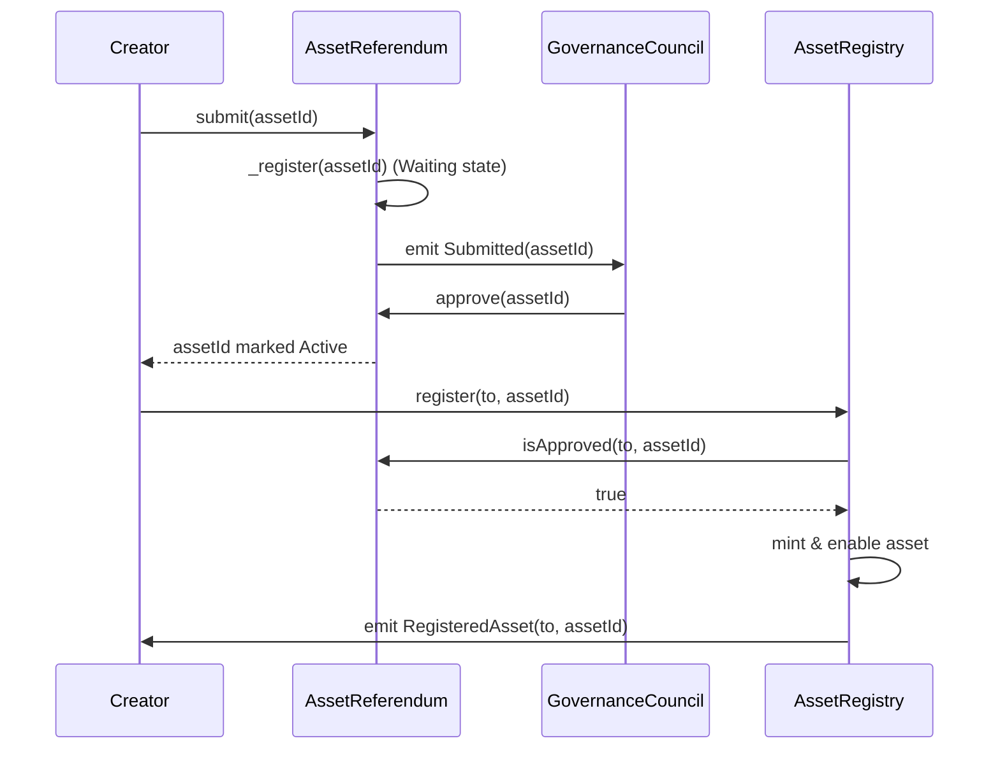
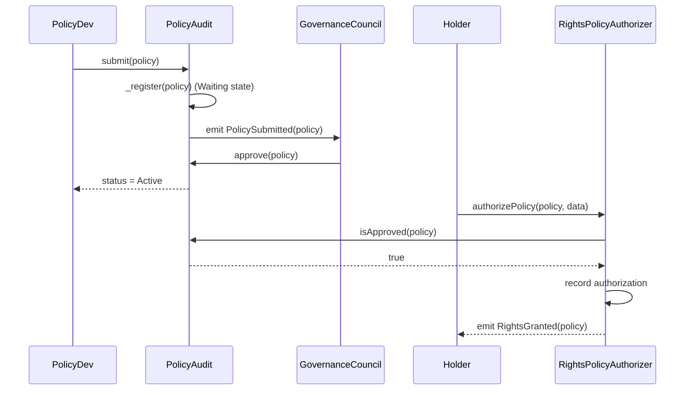
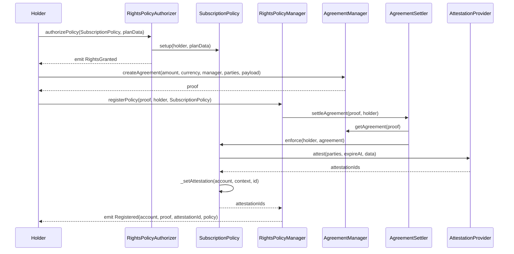
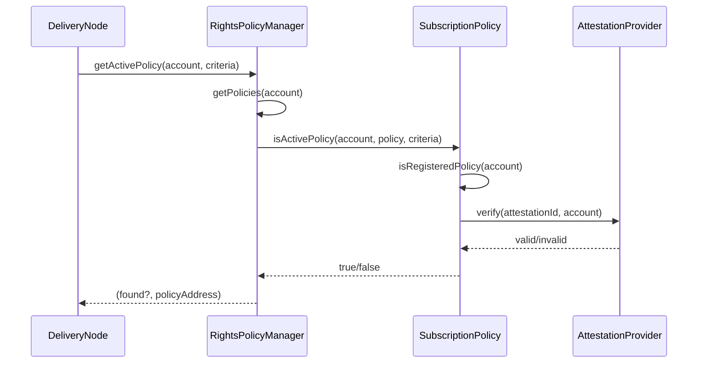
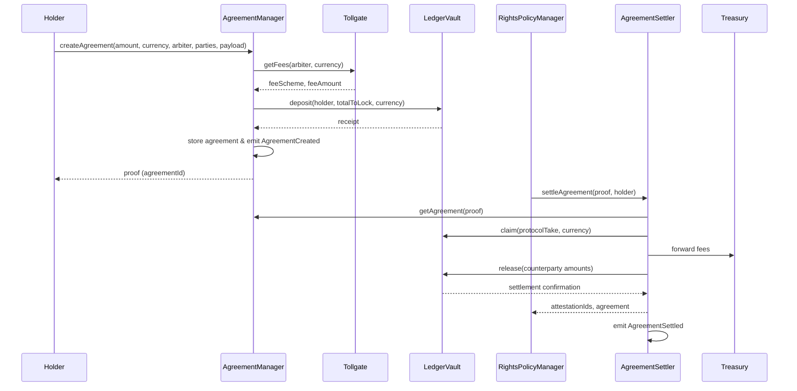

## Synapse Protocol – Auditor Documentation (v1)

> **Scope**: Assets, Rights & Policies, Finance (Escrow & Settlements), Economics, Governance, Access Control  
> **Out of Scope**: Custodian Network (DePIN), DWRR routing, replication/delivery infrastructure

---

### 1. Overview

Synapse Protocol provides a deterministic coordination layer for digital asset registration, licensing, and monetization. Creators define programmable access rules enforced on-chain, with all state transitions governed by role-based permissions and quorum-driven governance. This document summarizes architecture, modules, dependencies, and key audit checkpoints.


---


### 2. Layered System Architecture

| Layer | Purpose | Key Components | Notes |
| --- | --- | --- | --- |
| **Blockchain Layer** | Anchors protocol state on EVM networks; executes verifiable rights and settlement logic. | Deployed contracts for Assets, Rights, Policies, Finance, Economics, Governance, Access Control. | Deterministic calldata interactions enable auditability and integrations. |
| **Coordination Layer** | Core execution environment managing registries, policies, governance, financial ops and economics modules. | Asset registry, referendum, policy authorizer/manager, settlement engines, economics controllers (fees/tollgate, treasury). | Primary audit focus; ensures modules compose deterministically. |
| **Integration Layer / Peripheral Layer** | Bridges external applications, attestation services, marketplaces. | Peripheral contracts such as `SubscriptionPolicy`, `IAttestationProvider` adapters (e.g., EAS), future SEP integrations. | Minimal in current scope; policies/attestors plug into the coordination layer via `PolicyBase`. |

---

### 3. Smart Contract Summary

| Module | Description & Logic | Core Contracts | Critical Functions | Relationships & Dependencies |
| --- | --- | --- | --- | --- |
| **Access Control** | Central role matrix, permission routing, pausing, upgrade authorization. | `AccessManager`, `AccessControlledUpgradeable`, OZ `AccessManagerUpgradeable` | `grantRole`, `revokeRole`, `setTargetFunctionRole`, `setRoleAdmin`, `setTargetClosed`, `_authorizeUpgrade` | All upgradeable modules initialize with `__AccessControlled_init(accessManager)`. Roles (`ADMIN_ROLE`, `GOV_ROLE`, `OPS_ROLE`, etc.) defined in `C`. Uses UUPS upgrade pattern. Contracts inheriting this mixin are pausable (`whenNotPaused`, `restricted`) and can be halted via governance-controlled roles. |
| **Governance** | Quorum-based approval pipelines for assets and policies; manages FSM transitions. | `AssetReferendum`, `PolicyAudit`, `QuorumUpgradeable` | `submit`, `approve`, `reject`, `revoke`, `isApproved`, `isRejected`, `isPending` | Governed by `AccessManager` roles; relies on `T.Status` state machine. Emits `Submitted`, `Approved`, `Rejected`, `PolicyApproved`, `PolicyRevoked`. |
| **Assets** | ERC-721 lifecycle management with governance approval and activation controls. | `AssetRegistry`, `AssetReferendum`, `AssetSafe` | `AssetRegistry.register`, `revoke`, `transfer`, `switchState`; `AssetReferendum.submit`, `approve`, `reject`, `revoke`, `isApproved` | `AssetRegistry` queries `IAssetReferendumVerifiable.isApproved`; inherits `AccessControlledUpgradeable`. `AssetReferendum` extends `QuorumUpgradeable`. |
| **Policies** | Reusable policy primitives providing attestation workflows and auditing pipeline. | `PolicyBase` (abstract), `PolicyAudit`, domain policy implementations | `PolicyBase.setup`, `enforce`, `_commit`, `_setAttestation`, `getLicense`; `PolicyAudit.submit`, `approve`, `reject`, `isApproved`, `isRejected`, `isPending` | `PolicyBase` holds immutables for `RightsPolicyManager`, `RightsPolicyAuthorizer`, `IAssetRegistry`, `IAttestationProvider`. `PolicyAudit` is consumed by authorizer via `isApproved`. |
| **Rights** | Authorizes policies and enforces access rights over assets; coordinates settlement process. | `RightsPolicyAuthorizer`, `RightsPolicyManager`, `RightsAssetCustodian` | `RightsPolicyAuthorizer.authorizePolicy`, `revokePolicy`, `isPolicyAuthorized`, `getAuthorizedPolicies`; `RightsPolicyManager.registerPolicy`, `getActivePolicy`, `getActivePolicies`, `getPolicies`, `isActivePolicy` | Authorizer depends on `PolicyAudit` (approval), `AccessManager` roles, internal `_authorizing` guard. Manager interacts with `IAgreementSettler`, `IAgreementManager`, `IRightsPolicyAuthorizerVerifiable`, and policy contracts (via `PolicyBase`). |
| **Finance** | Agreement creation, escrow, settlement, fee routing, ledger management. | `AgreementManager`, `AgreementSettler`, `LedgerVault`, `Treasury` | `AgreementManager.createAgreement`, `previewAgreement`, `setMaxParties`; `AgreementSettler.settleAgreement`, `quitAgreement`; `LedgerVault.deposit`, `release`, `claim`; `Treasury` distribution functions | `AgreementManager` validates fees via `Tollgate`, stores collateral in `LedgerVault`. `AgreementSettler` executes payouts, emits `AgreementSettled`. |
| **Economics** | Configures fees, basis-point schedules, token economics, and treasury flows. | `Tollgate`, `Treasury`, economic permission scripts | `Tollgate.setFees`, `getFees`, `supportedCurrencies`, `updateSupportedCurrency`; `Treasury.withdraw`, `distribute` | Economics modules referenced by `AgreementManager`/`AgreementSettler`. `Tollgate` controlled via governance (`AccessManager` roles). |

#### Core Directory Components

| Subdirectory | Purpose | Key Elements |
| --- | --- | --- |
| `contracts/core/interfaces` | Canonical interfaces consumed across modules. | Rights (`IRightsPolicyAuthorizer`), Finance (`IAgreementManager`), Assets (`IAssetReferendumVerifiable`), Attestations (`IAttestationProvider`). |
| `contracts/core/primitives` | Shared primitives (Structs, constants, upgradeable mixins). | `AccessControlledUpgradeable`, `QuorumUpgradeable`, `T` (Types), `C` (Constants). |
| `contracts/core/libraries` | Deterministic utility libraries. | `FinancialOps`, `FeesOps`, `LoopOps`, `CriteriaOps`. |
| `contracts/core/primitives/upgradeable` | UUPS-ready mixins for inheritance. | `AccessControlledUpgradeable`, `ReentrancyGuardTransientUpgradeable`. |


---

### 4. Governance Structure

| Role | Description | Responsibilities | Assigned Entities |
| --- | --- | --- | --- |
| `ADMIN_ROLE` | Core administrators controlling upgrades, pause/unpause, and role granting. | `_authorizeUpgrade`, `setTargetFunctionRole`, `setTargetClosed`, emergency actions. | Multisig / governance executor (per deployment). |
| `GOV_ROLE` | Community governance authority. | Approves council compositions, economics changes, policy & asset referendums. | DAO governance process. |
| `CONTENT_COUNCIL_ROLE` | Oversees content curation and asset approvals. | Voting on `AssetReferendum` submissions. | Council multisig. |
| `CUSTODY_COUNCIL_ROLE` | Manages custodial operations and related referendums. | Approving custodial contracts, emergency custodial actions. | Custody council. |
| `OPS_ROLE` | Operational role granted to trusted system contracts. | Invoke restricted functions (`restricted` modifier), handle automated flows. | Contracts like `AgreementManager`, `RightsPolicyManager`, etc. |
| `SEC_ROLE` | Security guardianship (if implemented). | Fast emergency responses (pause, disable assets). | Security council. |
| `TREASURER_ROLE` | Treasury management. | `Treasury` withdrawals/distributions, economic adjustments. | Treasury multisig. |
| `VER_ROLE` | Verified creators/participants. | Bypass certain checks (e.g., asset verification) when designated. | Trusted creators or nodes. |

*Hierarchy*: `GOV_ROLE` (community governance) → councils (`CONTENT_COUNCIL_ROLE`, `CUSTODY_COUNCIL_ROLE`, `TREASURER_ROLE`) → ops roles (`OPS_ROLE`, `SEC_ROLE`) → contracts/users. `ADMIN_ROLE` executes governance-approved actions (upgrades, role assignments) within `AccessManager`.


---

### 5. Module Topology & Flow

**Narrative Flow**
1. `AccessManager` assigns roles; governance modules operate via `QuorumUpgradeable`.
2. Asset creators submit proposals to `AssetReferendum`; `AssetRegistry.register` mints ERC-721 upon approval.
3. Policies pass `PolicyAudit`; rights holders call `RightsPolicyAuthorizer.authorizePolicy`.
4. `AgreementManager` creates escrow-backed agreements (fees via `Tollgate`, collateral into `LedgerVault`), returning a proof.
5. `RightsPolicyManager.registerPolicy` consumes the proof, triggers `AgreementSettler`, and executes `PolicyBase.enforce`, storing policy references.
6. Economics layer (`Tollgate`, `Treasury`) distributes protocol fees during settlement; finance components (`LedgerVault`, `Treasury`) handle balances and payouts.

**ASCII Diagram**
```
[AccessManager / Role Control]
          |
          v
   [AssetReferendum] --> approves --> [AssetRegistry]
          |                                 |
          v                                 v
   [PolicyAudit] --(isApproved)--> [RightsPolicyAuthorizer]
          |                                 |
          |                                 v
          |                       [RightsPolicyManager]
          |                                 |
          |                     (settle)    v
          |                         [AgreementSettler]
          |                                 |
          |                        [Tollgate / Treasury]
          |                                 |
          |                        [LedgerVault payouts]
          |
  governance oversight, upgrades, fee configuration
```

---

### 6. Contract Relationships

| Relationship | Direction | Description | Events / Standards |
| --- | --- | --- | --- |
| Role Assignment | `AccessManager` → All modules | Configures privileged functions, pausing, upgrades. | OpenZeppelin Access Manager, UUPS. |
| Content Approval | `AssetReferendum` → `AssetRegistry` | Registration gated by referendum-approved asset ID. | `Submitted`, `Approved`, `RegisteredAsset`. |
| Policy Auditing | `PolicyAudit` → `RightsPolicyAuthorizer` | `authorizePolicy` permitted only if `isApproved`. | `PolicyApproved`, `PolicyRevoked`. |
| Rights Enforcement | `RightsPolicyAuthorizer` → `PolicyBase.setup` & `RightsPolicyManager.registerPolicy` | Holder-driven authorization; manager enforces via authorized policies; reentrancy guard prevents recursion. | `RightsGranted`, `RightsRevoked`, `Registered`. |
| Policy Registration | `RightsPolicyManager` → `AgreementSettler` → `PolicyBase` (`enforce`) | Settles agreements, retrieves attestations, registers policies. | `AgreementSettled`, `AttestedAgreement`. |
| Settlement Execution | `AgreementSettler` → `AgreementManager` / `LedgerVault` / `Treasury` | Reads agreements, claims protocol fees, releases funds to counterparties. | `AgreementSettled`, ledger transfer events. |
| Escrow & Fees | `AgreementManager` ↔ `Tollgate` / `LedgerVault` | Validates fees, stores collateral, handles releases. | ERC-20 operations via `FinancialOps`; events `AgreementCreated`, `AgreementSettled`. |
| Economics Distribution | `Tollgate` / `Treasury` → Finance & Governance | Tollgate manages fee schedules; Treasury receives protocol take after settlement. | Fee events in `Tollgate`; Treasury distributions (if implemented). |
| Attestation Integration | `PolicyBase` → `IAttestationProvider` | Issues attestation IDs for parties; stored for `isActivePolicy`. | Future SEP integration noted. |
| Upgrade Authorization | `AccessControlledUpgradeable` → `AccessManager` | `_authorizeUpgrade` restricted to admin. | UUPS proxy. |

---

### 7. Critical Invariants & Controls

- **Access Control**: All privileged functions protected by target function roles (`restricted`, `onlyAdmin`). Contracts inheriting `AccessControlledUpgradeable` are pausable (`whenNotPaused`) and subject to governance-controlled halt/resume. Misconfiguration centralizes risk at `AccessManager`.
- **Quorum FSM**: `QuorumUpgradeable` enforces state transitions (Pending → Waiting → Active/Blocked) for `AssetReferendum` and `PolicyAudit`.
- **Policy Authorization**: `RightsPolicyAuthorizer` uses `_authorizing` guard to prevent recursive `authorizePolicy`; `RightsPolicyManager` relies on `onlyAuthorizedPolicy`.
- **Settlement Integrity**: `RightsPolicyManager.registerPolicy` reverts on settlement or enforcement failure, preventing half-complete state.
- **Attestation Lifecycle**: `PolicyBase._commit` ensures attestation arrays match parties, `_setAttestation` binds context to IDs.
- **Financial Safety**: `FinancialOps`/`FeesOps` check zero amounts, zero recipients, balance sufficiency; auditors should review edge cases and revert behavior.
- **Economics Configuration**: `Tollgate` fee schedules are governance-controlled; verify no fee bypass. `Treasury` distribution flows must match governance rules.
- **Upgrade Safety**: UUPS contracts restrict `_authorizeUpgrade` to admin role; confirm governance process for upgrade proposals/execution.
- **Event Traceability**: Domain events (`RegisteredAsset`, `PolicyApproved`, `AgreementSettled`, fee events) provide verifiable trails.

---

### 8. Sequence Diagrams

> The diagrams follow the logical lifecycle: asset onboarding → policy vetting → rights registration → content delivery → settlement.

#### 8.1 Asset Approval & Registration


**Notes**
- `AssetReferendum` uses `QuorumUpgradeable` (Pending → Waiting → Active/Blocked).
- Registration reverts if the referendum status is not Active.

#### 8.2 Policy Audit & Authorization


**Notes**
- Policy audit follows the same quorum FSM as asset approval.
- Authorization attempts fail if audit status is not Active or if ownership checks fail.

#### 8.3 Rights Policy Management (Subscription Example)


**Notes**
- Policies derived from `PolicyBase` call `_commit` to generate attestations aligning parties and plan metadata.
- Registration is idempotent due to `EnumerableSet` storage per account.

#### 8.4 Content Access Authorization (Delivery Nodes)


**Notes**
- Delivery nodes act as content gateways; they query policies to decide whether to serve protected content.
- `criteria` encapsulates context (assetId, holder, plan tier, expiry) for policy evaluation.

#### 8.5 Financial Escrow & Settlement


**Notes**
- `totalToLock = amount + penalization` enforcing honest participation; protocol take = fees + penalization.
- Treasury handles protocol fees while counterparties receive releases from `LedgerVault`.
- Settlement artifacts (attestation IDs, events) feed into rights verification and compliance analytics.

### 9. Audit Checklist

1. **AccessManager Configuration**  
   - Verify role assignments, target function mappings, pause controls.
2. **Governance FSM**  
   - Inspect `QuorumUpgradeable` state transitions for assets/policies.
3. **Policy & Rights Flow**  
   - Test authorization guard, duplicate policy registration, revocations.
4. **Financial Settlement**  
   - Validate fee calculations, penalties, ledger updates through settlement and quit flows.
5. **Economics Modules**  
   - Review fee schedule management in `Tollgate`, treasury distribution logic, and permissioning.
6. **Attestation Providers**  
   - Evaluate deployed `IAttestationProvider` contracts for data integrity and replay protection.
7. **Upgrade & Pause Controls**  
   - Confirm `_authorizeUpgrade` restrictions and governance oversight; ensure pausable functions behave as expected.

---

### 10. Tooling & Development Environment

| Category | Tools / Frameworks | Notes |
| --- | --- | --- |
| Smart Contract Development | Foundry (forge/anvil), Solidity ^0.8.26 | Deterministic builds, fuzzing, invariants. |
| Libraries | OpenZeppelin Upgradeable suite, custom Synapse core libraries (`FinancialOps`, `FeesOps`, `QuorumUpgradeable`). | UUPS proxies, access control, quorum FSMs. |
| Testing | Forge standard library (`forge-std`), fuzz/invariant tests under `test/`. | Tests cover unit, fuzz, and integration flows. |
| Deployment | CREATE3 factory scripts (`script/deployment/*.s.sol`), custom orchestrations. | Deterministic addresses via CREATE3 salts. |
| Security | Slither (config in `slither.config.json`), manual audits. | Recommended for static analysis and coverage checks. |
| Attestation Infra | Ethereum Attestation Service (EAS) (planned), `IAttestationProvider` adapters. | Pluggable provider for policy attestations. |

### 11. Peripheral Implementations

- Subscription policy (`SubscriptionPolicy`) built atop `PolicyBase`: https://github.com/Synaps3Protocol/protocol-periphery-v1/blob/main/contracts/policies/SubscriptionPolicy.sol
- EAS attestation provider adapter: https://github.com/Synaps3Protocol/protocol-periphery-v1/blob/main/contracts/attestation/Eas.sol

### 12. Deployment Runbooks

| Stage | Scripts (order) | Purpose |
| --- | --- | --- |
| Deployment | `deployment/04_Deploy_Economics_Tollgate` → … → `17_Deploy_RightsManager_PolicyManager` | Provision economics, finance, custody, assets, policies, rights modules via CREATE3. |
| Orchestration | `orchestration/01_Orchestrate_ProtocolHydration` → `03_Orchestrate_ProtocolRightsCustodian` | Hydrate protocol with roles, economic parameters, and custodial network. |
| Upgrade | `upgrades/01_Upgrade_Economics_Tollgate` → … → `17_Upgrade_Rights_RightsPolicyManager` | Apply UUPS upgrades in deterministic order. |

**Pause / Unpause Runbook**
1. `SEC_ROLE` is the designated role to pause affected modules (using exposed `pause()` on `AccessControlledUpgradeable`).
2. Execute pause transactions on required modules (e.g., `RightsPolicyManager.pause()`, `AgreementManager.pause()`, `LedgerVault.pause()` as required).
3. Broadcast incident report; disable user-facing services.
4. Remediation: deploy fixes or configuration changes under audit.
5. Submit proposal to unpause; `SEC_ROLE` executes `unpause()` in reverse order once mitigation is confirmed.
6. Document event, update post-mortem, and notify stakeholders.

*Run scripts with `make deploy script=<path>` for canonical ordering.*

### 13. Deployment Addresses (Amoy Testnet)

| Contract | Address |
| --- | --- |
| AccessManager | `0x8120a8e0688be6b2c0bb469f871e5e7023ca85eb` |
| AssetReferendum | `0x4edf864dc5e7ef1a15b472954e994f4f95e4d1ab` |
| AssetRegistry | `0xb439928f5dd092e010c802228d1191e64431eebf` |
| AssetSafe | `0x4aeb687f491f91234ff6c25170db06fde505014c` |
| RightsPolicyAuthorizer | `0x64c03e378f29d7a39a9cf2c509c4332336e44d5b` |
| RightsPolicyManager | `0xac21c4a4ab26c295856365541dab1b4c8873d109` |
| PolicyAudit | `0xe9ff2342903c5c3975cdae572a937626cbf3d9ed` |
| AgreementManager | `0x7281685b064d6ffbf77df3e5442f65462e945b0e` |
| AgreementSettler | `0x20ee3ad9ed569832b451cf796190349a9d6d673e` |
| LedgerVault | `0x5855f2c385d526e93802123d5cb54465c4e3871c` |
| Treasury | `0x2bef3819db8181e8d86eb1b2fb3e5999b2ebb8d1` |
| Tollgate | `0xbae832ee0bd9c212212f7f0190cc3b8ca8586ed3` |
| RightAssetCustodian | `0xbd67e67756415576002f67856833f9636c24e199` |
| CustodianFactory | `0x2b03c944c50e373124d4f4fa117037215acf084c` |
| CustodianReferendum | `0x31f32d9066257805ccccbfe46cfc2455fddd902c` |
| DefaultCustodian | `0x5b903c9598409a6857056fc8a397f74716a5c71d` |
| MMC Token | `0x3c7deb6feaeb7a82bde580fb73d8d69c401b219e` |
| SubscriptionPolicy | `0x3393520c79e540c963afae6619c2b51e6fb04f61` |
| EAS Attestation Provider | `0xdb33bda43befada78d36cbc4362ac6f240084e7b` |

**Attestation Provider (example)**: Ethereum Attestation Service (EAS) can serve as the concrete `IAttestationProvider` implementation.

*Note*: `SubscriptionPolicy` and the EAS adapter operate in the peripheral/integration layer, interfacing with the coordination layer via `PolicyBase` APIs.


### 14. References & Notes

- **Libraries & Standards**: OpenZeppelin Upgradeable suite, custom `FinancialOps`, `FeesOps`, `QuorumUpgradeable`, `ERC721StatefulUpgradeable`.  
- **Future Standards (planned)**: SEP-001/002 (asset metadata), SEP-004 (license metadata), EAS attestation registry.  
- **Event Catalog**:  
  - Assets: `RegisteredAsset`, `RevokedAsset`, `AssetEnabled`, `AssetDisabled`.  
  - Policies: `PolicySubmitted`, `PolicyApproved`, `PolicyRevoked`, `AttestedAgreement`, `AgreementCommitted`.  
  - Rights: `RightsGranted`, `RightsRevoked`, `Registered`.  
  - Finance/Economics: `AgreementCreated`, `AgreementSettled`, `FeesSet` (Tollgate), treasury distributions.

---


Prepared for Synapse Protocol auditors to evaluate module architecture, invariants, inter-module dependencies, and governance controls. For comprehensive coverage, integrate attestation provider audits and upcoming economics/custody extensions as they are deployed.
