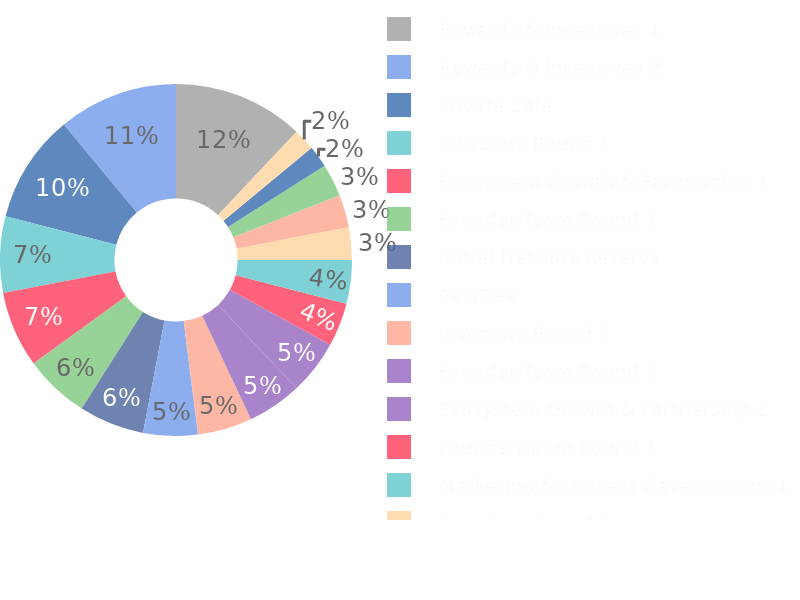
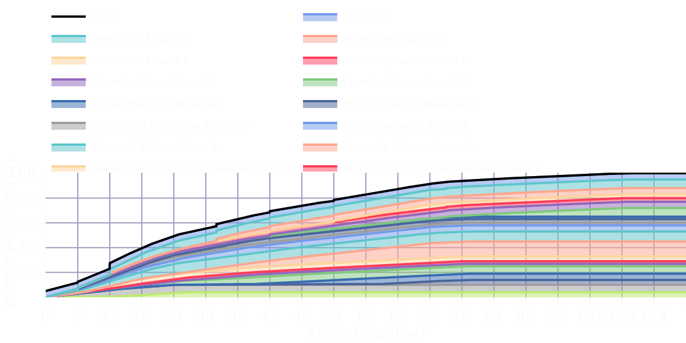
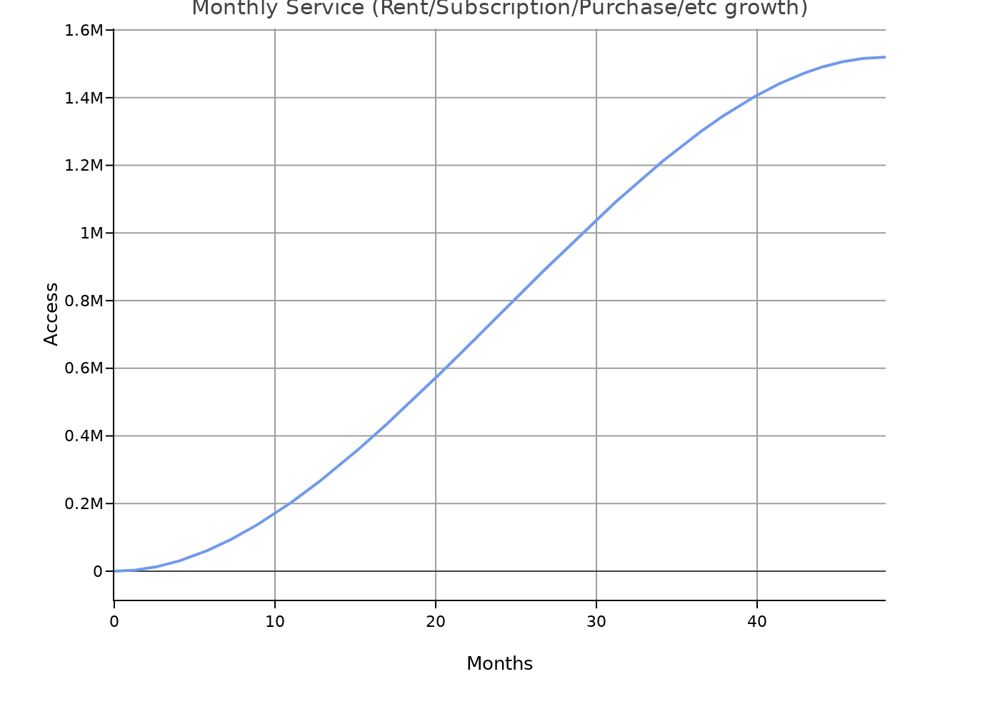
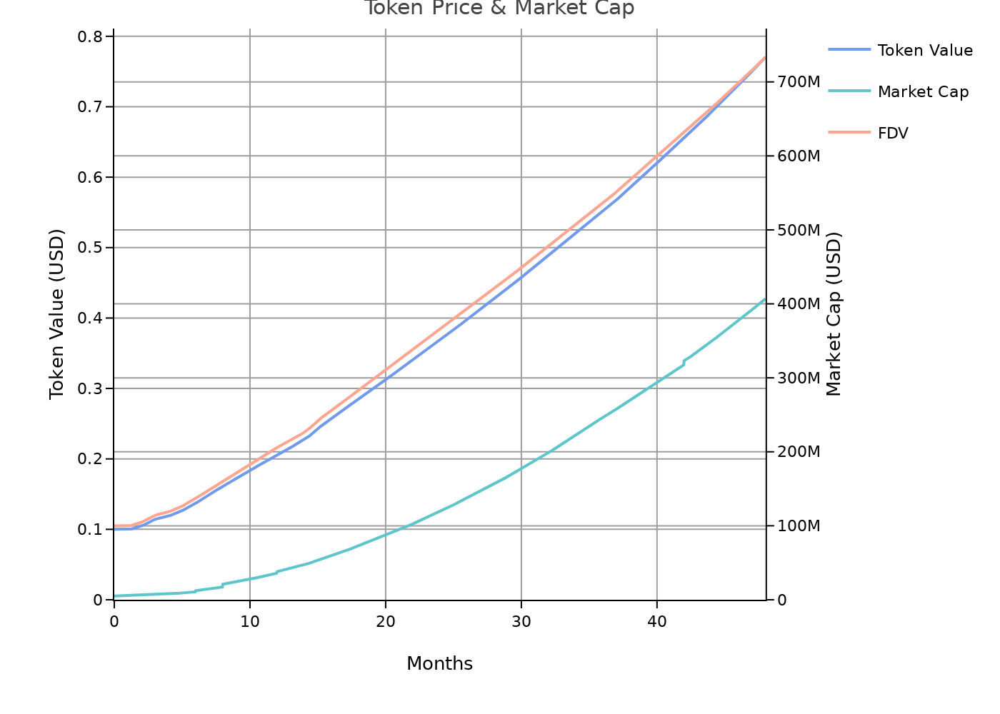
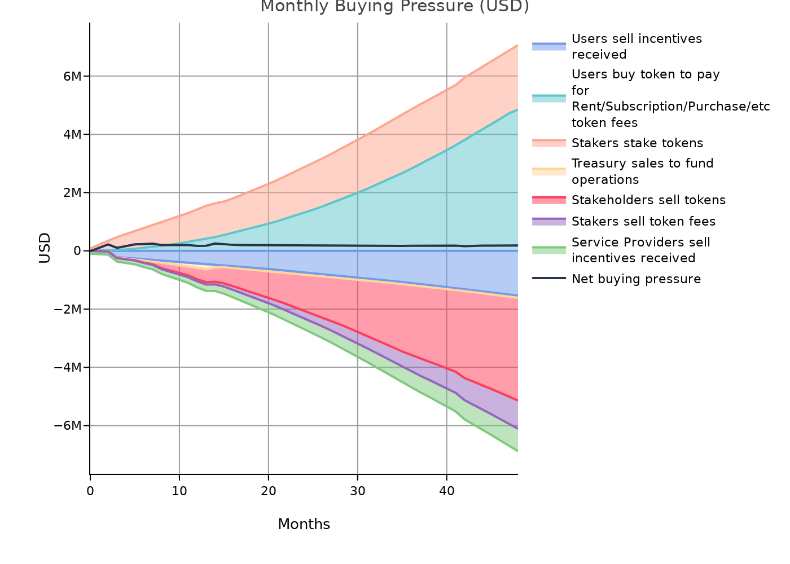
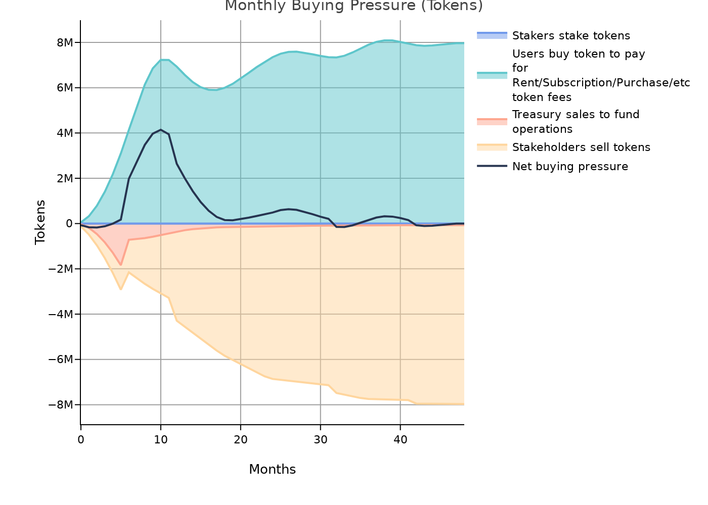
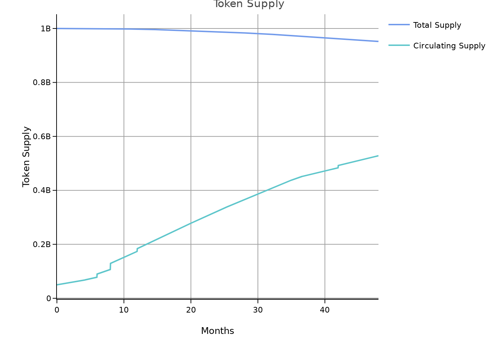
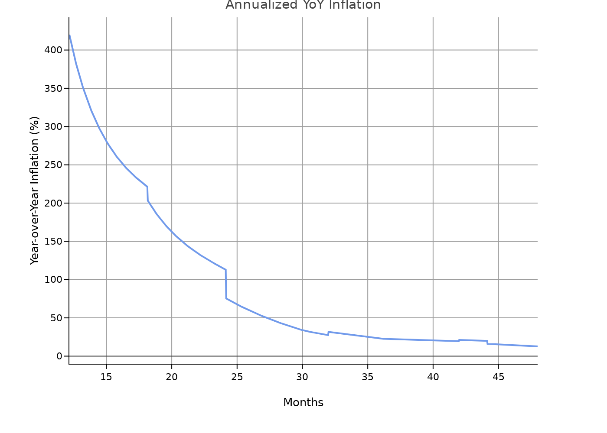
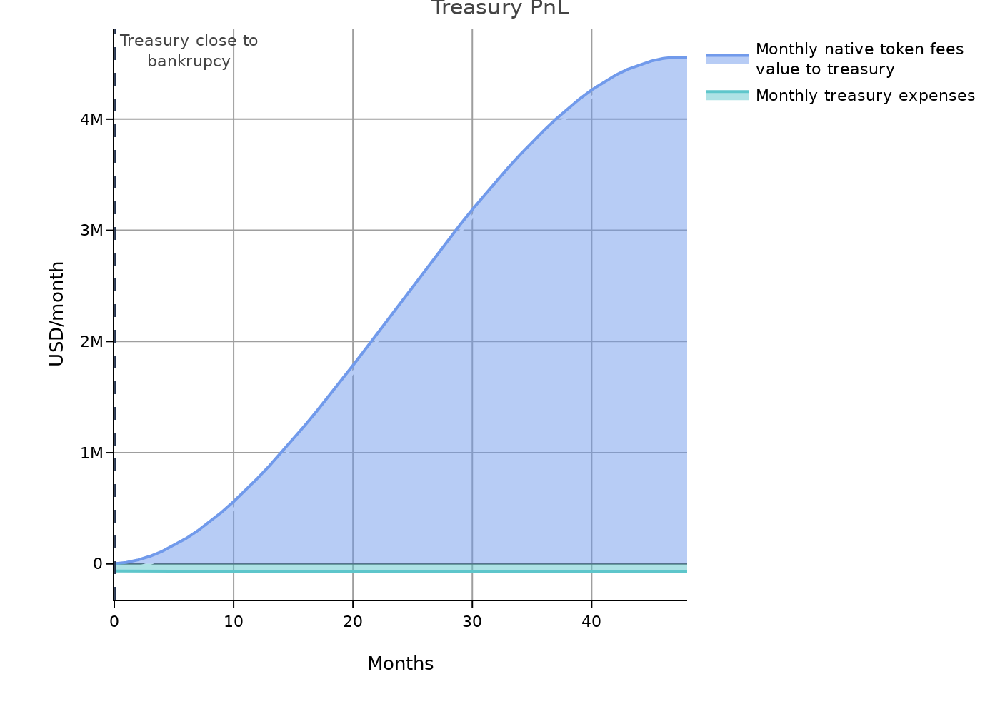
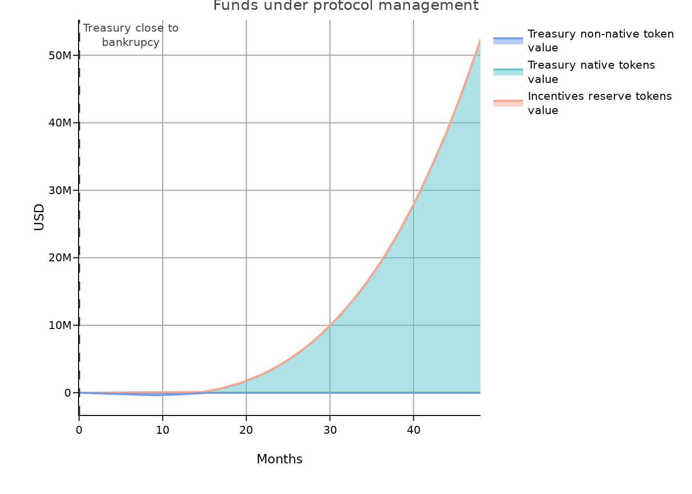

# MMC Whitepaper

## Allocation and Vesting Schedule

The issuer, MMC, commits to having a maximum supply of 1000000000 tokens, vested over a total of 132 months.

The allocation and vesting of tokens is as follows:

| Entity                            |   Allocation (%) |   Vesting Start (month) |   Vesting Cliff (month) |   Vesting Duration (months) |
|:----------------------------------|-----------------:|------------------------:|------------------------:|----------------------------:|
| Cex/Dex                           |                5 |                       0 |                       0 |                           0 |
| Investors Round 1                 |                7 |                       0 |                       6 |                          36 |
| Investors Round 2                 |                5 |                      36 |                       6 |                          36 |
| Investors Round 3                 |                3 |                      72 |                       3 |                          24 |
| Founder/Team Round 1              |                4 |                       0 |                      12 |                          48 |
| Founder/Team Round 2              |                5 |                      48 |                       6 |                          48 |
| Founder/Team Round 3              |                6 |                      84 |                       3 |                          48 |
| Exclusive Airdrops                |                2 |                       0 |                       0 |                          24 |
| Initial Network Reserve           |                6 |                       0 |                       0 |                          60 |
| Rewards & Incentives 1            |               12 |                       3 |                       0 |                          60 |
| Rewards & Incentives 2            |               11 |                      60 |                       0 |                          60 |
| Marketing & Content Development 1 |                4 |                       6 |                       0 |                          36 |
| Marketing & Content Development 2 |                3 |                      36 |                       0 |                          24 |
| Marketing & Content Development 3 |                2 |                      60 |                       0 |                          24 |
| Ecosystem Growth & Partnership 1  |                7 |                       0 |                       0 |                          36 |
| Ecosystem Growth & Partnership 2  |                5 |                      36 |                       0 |                          36 |
| Ecosystem Growth & Partnership 3  |                3 |                      72 |                       0 |                          24 |
| Private Sale                      |               10 |                       0 |                       8 |                          36 |

## Value propositions and their interaction with the token economy

The main value proposition of MMC is our Rent/Subscription/Purchase/etc services. The business model for this value proposition is to charge a service fee. The fees will be distributed as follows: 20.00% for the stakers, 50.00% for the treasury, and 30.00% to be burnt.

## Token utilities

The token presents the following utilities:

- The token will be used as currency for the Rent/Subscription/Purchase/etc fees.
- 30.00% of the fee charged in Rent/Subscription/Purchase/etc will be used to buy back and burn the token.
- 50.00% of the fee charged in Rent/Subscription/Purchase/etc will be sent to the treasury.
- Rent/Subscription/Purchase/etc will be used to reward stakers.
- The token is a governance token, with voting power for managing the treasury funds.

## Token incentives

In addition to the utilities listed above, some of the token allocation has been reserved for incentivizing the Users and the Service Providers, in order to accelerate the MMC flywheel.

- **Initial Network Reserve**: for the Service Providers, distributed at as the it vests (see the vesting schedule above).
- **Rewards & Incentives 1**: for the Users, distributed at as the it vests (see the vesting schedule above).
- **Rewards & Incentives 2**: for the Users, distributed at as the it vests (see the vesting schedule above).

## Projected organic growth of the token economy

The features detailed above have been introduced into the [Space and Tokens simulation platform](https://cenit.finance) to project the evolution of the token economy over time. These projections focus on the organic growth of the token economy, that is, on the buying and selling pressure coming from protocol users, and not on speculative trading. The full simulation results are available [here](https://spaceandtokens.ai/simulation/71136d43-fa5e-4db2-958b-6f296a4a3265).

The results projected here are based on growth assumptions for the Rent/Subscription/Purchase/etc value proposition, reflected in the following chart:

### Token price and market cap

Based on the simulation results, the MMC token is expected to evolve in value as follows:

### Supply and inflation

### Protocol fees

The following chart showcases how the fees generated by the protocol are expected to evolve over time, and how they will be distributed.

By year 4, the protocol is expected to have generated a total value of approximately $76100000 in fees. This is comes from estimating an average service fee of 5.0 %.

### Treasury

The treasury is expected to have the following profit and loss:

The treasury is expected to have the following funds under management:

By year 4, the treasury is expected to have a total value of approximately $52300000 under management, with 99% in native tokens and 0% in other currencies.

